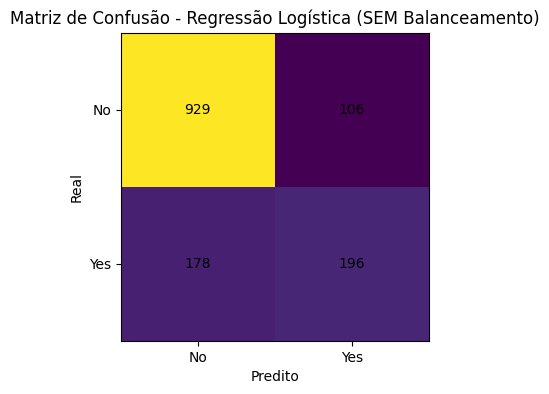
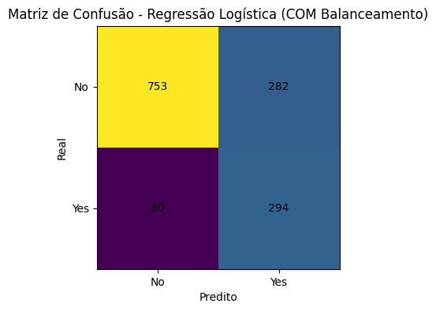
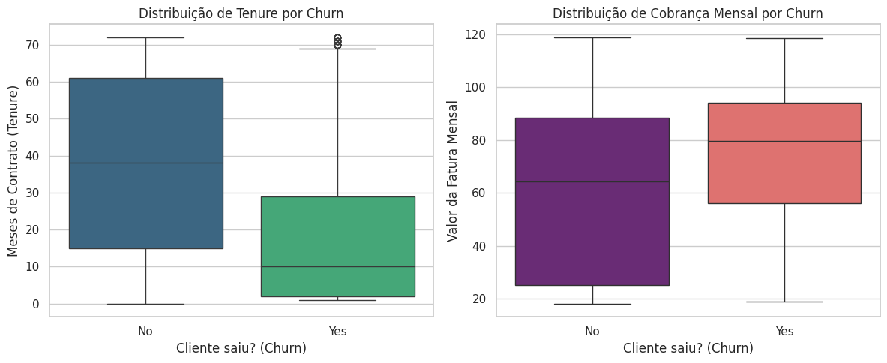

# 📡 Telecom X — Predição de Churn (Parte 2)

Este repositório contém o desenvolvimento de um modelo preditivo de classificação para identificar antecipadamente clientes com alta probabilidade de evasão (Churn) na operadora Telecom X.

---

## 📌 Sumário
* [Objetivo do Projeto](#-objetivo-do-projeto)
** [Tecnologias Utilizadas](## Tecnologias Utilizadas)
* [Etapas de Desenvolvimento](#-etapas-de-desenvolvimento)
* [Análise de Correlação](#-análise-de-correlação)
* [Performance do Modelo Final](#-performance-do-modelo-final)
* [Principais Insights](#-principais-insights)
* [Estratégias de Retenção Sugeridas](#-estratégias-de-retenção-sugeridas)
* [Como Executar](#-como-executar)
* [Contato](#-contato)

---

## 🎯 Objetivo do Projeto
A missão atual foi construir um pipeline robusto de Machine Learning para prever o cancelamento de serviços antes que ele ocorra, identificando variáveis críticas e apoiando a tomada de decisão estratégica para retenção de receita.

## 🛠️ Tecnologias Utilizadas
* **Linguagem:** Python
* **Bibliotecas:** Pandas, Seaborn, Matplotlib, Scikit-learn
* **Ambiente:** Google Colab / Jupyter Notebook

## 🧠 Etapas de Desenvolvimento
O projeto seguiu as melhores práticas de Ciência de Dados:
1.  **Pré-processamento:** Limpeza e tratamento de categorias redundantes.
2.  **Feature Selection:** Remoção de multicolinearidade e teste estatístico **Qui-Quadrado**.
3.  **Engenharia de Dados:** Aplicação de One-Hot Encoding e Normalização via `StandardScaler`.
4.  **Modelagem:** Comparação entre **Random Forest** e **Regressão Logística**.
5.  **Otimização:** Aplicação de balanceamento de classes (`class_weight="balanced"`).

## 📉 Análise de Correlação
Identificamos a necessidade de remover variáveis como `ChargesDaily` e `ChargesTotal` devido à colinearidade perfeita com as cobranças mensais.

## 📊 Performance do Modelo Final
O modelo selecionado foi a **Regressão Logística Balanceada**, priorizando o **Recall (Sensibilidade)** para capturar o maior número possível de evasões.

* **Recall:** **79%** (identifica quase 8 em cada 10 clientes em churn).
* **Impacto:** Redução expressiva de Falsos Negativos (de 178 para 80).

| Modelo SEM Balanceamento | Modelo COM Balanceamento |
| :---: | :---: |
|  | 

## 🔍 Principais Insights
A análise de coeficientes e boxplots revelou os maiores gatilhos de evasão:

* **⚠️ Fatores de Risco:** Contratos mensais, Fibra Óptica e faturas elevadas.
* **🛡️ Fatores de Retenção:** Contratos de longo prazo e tempo de permanência (*Tenure*).

## 💡 Estratégias de Retenção Sugeridas
1.  **Migração Incentivada:** Converter contratos mensais para anuais.
2.  **Fidelização Precoce:** Focar no atendimento nos primeiros 6 meses de contrato.
3.  **Qualidade Técnica:** Investigar a satisfação específica dos usuários de Fibra Óptica.

## 🚀 Como Executar
1. Clone o repositório.
2. Certifique-se de ter as bibliotecas instaladas (`pandas`, `seaborn`, `sklearn`).
3. Execute o arquivo `TelecomX_Modelo_Preditivo.ipynb`.

---
## 🤝 Contato
Desenvolvido por **Gelson Ribeiro Junior** [LinkedIn]((https://www.linkedin.com/in/gelsonribeirojr/)) | [GitHub]((https://github.com/GelsonRibeiroJr/))
